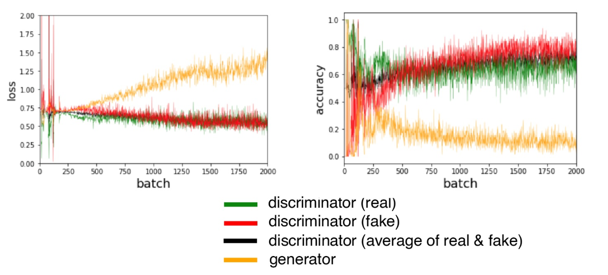

##  GAN and DCGAN in Keras


Tensorflow implementation of [Deep Convolutional Generative Adversarial Networks ](https://arxiv.org/abs/1511.06434) which is a stabilize Generative Adversarial Networks. The referenced torch code can be found [here](https://github.com/soumith/dcgan.torch).

This implementation mainly refers to [Generative Deep Learning](https://www.oreilly.com/library/view/generative-deep-learning/9781492041931/) by using Keras and Tensorflow. 

## How to use

First, the pre-process of dataset is in `dataload.py`.
We provide two methods. The first method is faster in reading, while the second method merges all datasets into one. 

```python
# the original dataset folder
IMAGE_FOLDER = os.path.join(os.getcwd(), 'out_data')

# the processed dataset folder
PROCESS_FOLDER = os.path.join(os.getcwd(), 'process_data/')
dataset_name = ["fruit/", "graffiti/", "metal/"]

# the name of processed dataset
process_image_name = ["fruit_image.npy", "graffiti_image.npy", "metal_image.npy" ]
```

Second, the implementation of GAN is in `gan_training.ipynb`. The GAN model is provided in `GAN.py`. Details and interpretation of every step have been shown in the content. 

Third, the implementation of DCGAN is in `dcgan_training.ipynb`. The DCGAN model is provided in `DCGAN.py`. Details and interpretation of every step have been shown in the content. 

The steps can be summarised as follows:

* choose your servers: google drive server or local server
* choose your dataset: 
```
process_image_name = ["fruit_image.npy", "graffiti_image.npy", "metal_image.npy" ]
```
* design your GAN/DCGAN model
* choose to start to build the model or use the previous training data
* start training 
* plot the loss and accurate result after training

## Result
From the generated images and the closest images, we can see that there is some degree of similarity between the generated images and the training set. However, they are not identical and the GAN is also able to add some information. This shows that the generator has understood these high-level features and can generate examples that are distinct from those it has already seen.

### Fruit dataset: 
#### DCGAN
Accuracy and Loss: 

 


Generated images and the cloest original images:

 


### Graffiti dataset: 
#### DCGAN
 


Generated images and the cloest original images:

 


### Metal dataset: 
#### DCGAN
 


Generated images and the cloest original images:

 


## Challenge 
#### Oscillating loss

Typically, there is some small oscillation of the loss between batches, but in the long term you should be looking for loss that stabilizes or gradually increases or decreases (see the figure below), rather than erratically fluctuating, to ensure your GAN converges and improves over time. 

 

However, in our training, the loss of the discriminator and generator oscillate wildly, rather than exhibiting long-term stability. 

#### Uninformative Loss
"Since our model is compiled to minimize the loss function, it would be natural to think that the smaller the loss function of the generator, the better the quality of the images produced. However, because the generator is only graded against the current discriminator and the discriminator is constantly improving, we cannot compare the loss function evaluated at different points in the training process. This lack of correlation between the generator loss and image quality sometimes makes GAN training difficult to monitor."

#### Hyperparameters
As well as the overall architecture of both the discriminator and the generator, there are the parameters that govern the batch normalization, dropout, learning rate, activation layers, convolutional filters, kernel size, striding, batch size, and latent space size to consider. GANs are highly sensitive to very slight changes in all of these parameters, and finding a set of parameters that works is often a case of educated trial and error, rather than following an established set of guidelines.

## Improvement 
Wasserstein GAN (WGAN) and Wasserstein GAN–Gradient Penalty (WGAN-GP). 


